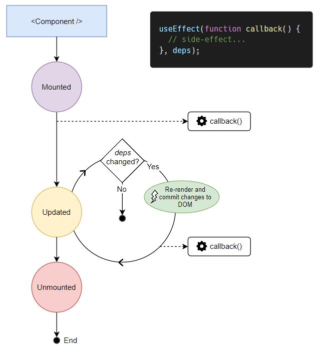
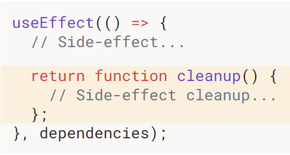
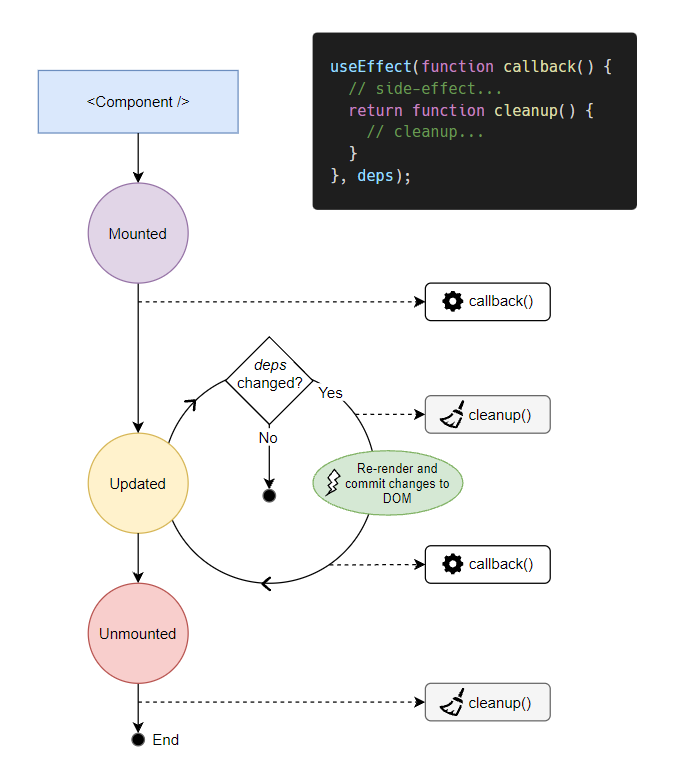
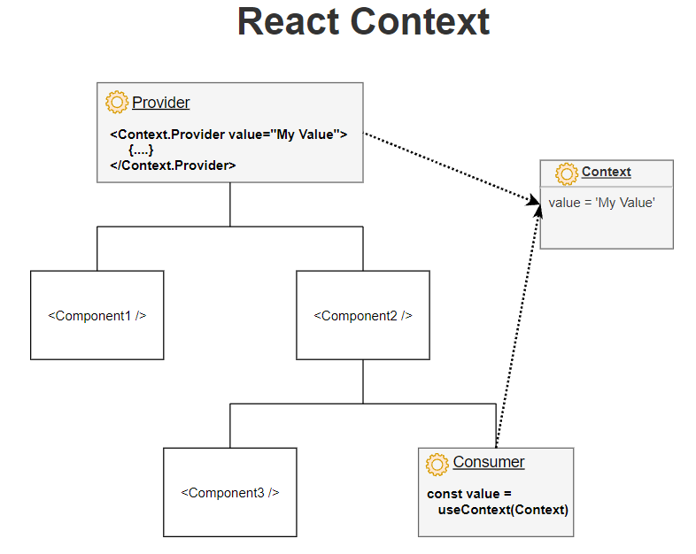

**<h1>REACT NOTES</h1>**
It is a client side JS library.
It creates a VIRTUAL DOM in memory.
Instead of manipulating the browser's DOM directly, React creates a virtual DOM in memory, where it does all the necessary manipulating, before making the changes in the browser DOM.
React only changes what needs to be changed.
It is all about building modern reactive user interfaces for the web.
Declarative, component-focused approach.

React can be used to control parts of HTML pages or entire pages.
'Widget' approach on a multi-page-application.
Some pages are still rendered on and served by a backend server.
Here some part of the page in controlled by react.

React can also used to control the entire frontend of a web application.
Single page application (SPA) approach.
Server only sends one HTML page. therafter, React takes over and control the UI.

Elements are the smallest building block of React apps.
An element describes what you want to see on the screen.

In <html_tag id="root"></html_tag>, the root here is called DOM Node because everything inside it will be managed by React DOM.

Therefore we render a React element into a root DOM Node.
React elements are immutable. i.e. once you create an element you cant change it children or attributes.
But we can update the UI is to create a new element

React Componenets are made of element(s).
React is all about components.
We build these individual components and then we tell react how to compose them together into a final user interface.
Classes or functions are used for creating components in React.
Componenets gives features like reuseability and seperation of concerns.

Mostly react is all about combining HTML and JAVASCRIPT together and then we can also add css but that's not the focus of React.
React uses declarative approach which defines the desired target state(s) and let react figure out the actual Javascript DOM instructions.
And then react figures out which element should be update, delete or displyed on the webpage.

##  

**JSX - JavaScript XML**

It converts HTML tags into react elements.
In react we must have one root element per return statement / per JSX statement. We cannot return two or more HTML components from one return statement and each react component has only 1 return statement.
But we can create a div inside a div. i.e. there must be only one main div and inside this main div we can mave multiple divs.
We can store JSX content in variables.
After compilation, JSX expressions becomes regular JavaScript function calls.

**Props**

Props in react are simple properties that we can use for outter components, just the same as we use in HTML components.
A parent compenent owns the prop and cannot be changed by the child component.
We can use props to share the data between two or more compenents.
we have a distinct props object for every component and for every instance of some component.

The process of building an user interface from smaller building blocks is called composition in React.
Composition are generally used as "Wrapper components" that add certain styling around the wrapped components.
We cannot use our custom components as wrappers around other kind of content.
having content inside a custom component does not work as same as default html tags.
So to build such wrappers components we use children props

_props.children contains all the content which is specified between the opening tag and closing tag of our custom components._

**Lists**

A “key” is a special string attribute you need to include when creating lists of elements.
Keys help React identify which items have changed, are added, or are removed. Keys should be given to the elements inside the array to give the elements a stable identity.
Keys serve as a hint to React but they don’t get passed to your components. If you need the same value in your component, pass it explicitly as a prop with a different name.

**Forms**

input type="text", textarea and select these tags accepts a value attribute that you can use to implement a controlled component.

**preventDefault is called on the event when submitting the form to prevent a browser reload/refresh.**

**Event Handler for react :-**

1. We can directly specify the action to be performed where the event handler is mentioned.
   Eg. **<button onClick={() => { Action to be performed }}>Click</button>**
2. We can define a function and then call that function.
   Eg. **<button onClick={call the function (write the name of the function. Dont invoke the function)}>Click</button>**

**States**

States and lisiting to user events helps us to change the content/interact with the page.
_State in React_-
States in the component changes over time. The changes in the state can be done by a user or can be a system event.
A state represents the component's local state or information. We can only modify the state inside that compenent

> useState()

> Syntax :- const[current_state, stateUpdateFunction] = useState(default_value / initial_State);

We pass useState() a default value to useState() as a parameter.
Now, there are two ways through which we can pass our default value to useState.
We can use useState hook to get the information provided/written in the form by any user at a particular state.

1. Directly hardcoded values
   Eg. useState(4)
   If we pass the value in this way, At every re-render the useState will be passed the same hardcoded value as the default value.
2. passing a function
   Eg. useState(() => {here we can pass the default value/function})
   If we pass the default value in this way, the useState will be passed the default value only once i.e. at the very first time when the component is rendered.
   And it returns a array with 2 values [state(currentstate), function_which_allows_us_to_update_the_state].
   The function which is returned by useState() is used to update the state. This function takes a callback function as an parameter.
   And the callback function returned by useState() which is a update function contains previous state as an parameter by which we can update the current state.
   Remember that we can also directly update the current state without taking/using the previous state but it much safer to use the previous state.
   If ur current state update is dependent upon the previous state then it it compulsory to use previous state.
   Each call to useState() create a single piece of state, holding a single value of any type.

There is a difference while dealing with useState() when we pass the default state as an object.
Whenever we update the value the object it doesnt merge the new state update with the previous state, instead it overrides it.
i.e if our object has more than one values inside it and we update only few of them then after rerendering the values, the values which are not updated are vanised from the object.
And only updated ones stays.
To avoid this we use spread operator, so we can also add the un-updated values to the updated ones.
Other way of doing this is that instead of using object and passing it to one useState() hooks for multiple states.
We can create multiple useState() hooks for multiple states. Hence we avoid the clashing of states.

It registers the state for a specified component instance.
i.e. If we have used the component(function) for multiple times, then for each of them this useState function will create a seperate state.
Hence when each of the components is called it creates a different states for each of them.
That is the reason why after updating one component the others are not affected because each one has seperate state.
REACT SCHEDULES STATE UPDATES, IT DOESNT PERFORMS THEM INSTANTLY.
Using state we can implement 2 way binding which means that for inputs we just dont listen to changes but also pass a new value back to the input.
So we can reset or change the values
We are passing data from child compenent to parent component by passing this data to the function we got from parent class.
This is called lifting up of state/data.

**MOVING DATA FROM CHILD COMPONENT TO PARENT COMPONENT**

We can do this by using props and get a function from parent compenent into child component and then passing the date into that component.

**Working with FRAGMENTS, PORTALS, REFS**

_LIMITATION OF JSX_

1.  We cannot render 2 JSX elements next to each other. i.e. we cannot return more than one root JSX elements from the return statement.
2.  To avoid using multiple divs / creating div soup we use fragments.
    FRAGMENTS allows us to write neat and clean code.

> useEffect()

> Syntax :- useEffect(callback, [dependencies]);
> useEffect(() => {
> The code written here will execute every time this hook executes.
> },[this array will contain some values and the hook will only execute when the values passed in the array will change]);

This hooks will perfrom some operations when something/side effect happens.
You must add all "things" you use in your effect function,"things" that could change because your component (or some parent component) re-rendered.
userEffect runs after completion of every components rendering cycle, IF WE DONT PASS THE SECOND ARGUMENT WHICH IS AN ARRAY.
But if you pass the second argument as an array(empty array) then the effect function will run for the first time, but not for the subsequent render cycle.
And if you pass any dependencies in the array then this effect function will run whenever the dependencies is present or valid.
Now, suppose your dependencie(s) is/are some properties of an object then we must only pass that properties of that object instead of passing the whole object in dependency array.
To pass the properties of an object we can use object destructuring or we pass the properties by using dot operator in dependency array.
In useEffect function we should always add everything we refer to indside useEffect as a dependency untill there is a good reason not to do that.
Put your side-effect logic into the callback function, then use the dependencies argument to control when you want the side-effect to run. That’s the sole purpose of useEffect().

<h2> Clean Up in useEffect :-</h2>
If the callback of useEffect(callback, deps) returns a function, then useEffect() considers this as an effect cleanup.Some side-effects need cleanup: close a socket, clear timers.

> Syntax :- 

**Working of CleanUP :-**

1. After initial rendering, useEffect() invokes the callback having the side-effect. cleanup function is not invoked.
2. On later renderings, before invoking the next side-effect callback, useEffect() invokes the cleanup function from the previous side-effect execution (to clean up everything after the previous side-effect), then runs the current side-effect.
3. Finally, after unmounting the component, useEffect() invokes the cleanup function from the latest side-effect.

 
 

> useReducer()

> Syntax :- const [current_state, dispatch] = useReducer(reducer_function, initial_State);

The initial_State mostly is an object as we deal with more complex states.
The reducer_function accepts 2 values and returns 1. The reducer function accepts the current state and returns the new state.
Depending on the action the reducer function will perform operations on the current state resulting in the new state.

> Syntax of reducer_function :- function reducer(current_state, action){ return new_state }

The current_state and the action can be normal values or can be object.
The useReducer hook returns 2 values, one is the current state and the other one is dispatch function.
This dispatch function helps us to use a particular action on reducer_function. We pass the action we want to perform as an parameter to dispatch function.
We can also pass a second paramter in the dispatch function known as payload which helps us to pass all need variables to the reducer function.
It is usally preferred to useState when you have complex state logic that involves multiple sub-values or when the next state depends on the previous state.
It allows functional components in React to access reducer functions form your statemanagement.

> CONTEXT APIs

Good Introduction :- https://medium.com/technofunnel/usecontext-in-react-hooks-aa9a60b8a461

In react we have Context APIs which helps use to create context Objects which allows us to manage the states kindoff behind the scenes in react such that we are able to directly change it
from any component in our APP and directly pass it to any other componenent in our APP wihout building such a props chain.
“useContext” hook is used to create common data or a kind of container of common data that can be accessed throughout the component hierarchy without passing the props down manually to each level.
The data in this context object can the simple variables or can be functions, etc.
Context defined will be available to all the child components without involving “props”.
Context helps us to avoid problems like "PROP DRILLING".

_PROVIDER_:-
Now, to use context we need to have a Provider which is basically telling react that the component which are wrapperd with this context can use this context.
Inshort, the Provider is to provide the context to its child components, no matter how deep they are.

> <ObjectName.Provider value={}> This ObjectName.Provider is used for providing value to the context object created.

The values(data) which we write in value = {} can be accessed by any component its sub-components and soon.. wrapped by PROVIDER
If you want to change the context value, simply update the value prop.

_CONSUMER:-_
And while using we need to consume it which means u need to hook it / listen it.
We can lisiten using ObjectName.Consumer or using a hook (useContext)

> <ObjectName.Consumer {(context) => {Here we return the JSX}}> So in the JSX whatever we got through the props is not achieved or can be accessed by context(object) pass in the function.

Now, using Consumer function whenever we need to use the context is OK.

But there is also a hook called useContext which is an alternative to this Consumer function.

> Syntax -->
>
> 1.  To create a context :- const ContextObject = React.createContext();
> 2.  To use the create context :- const valuesPresentInContextObject = useContext(ContextObject);

useContext() hook returns the value of the context.
const value = React.useContext(Context). The hook also makes sure to re-render the component when the context value changes.

We can have more than one consumer realted to one context.
If the consumer isn’t wrapped inside the provider, but still tries to access the context value (using useContext(Context) or <Context.Consumer>), then the value of the context would be the default value argument supplied to createContext(defaultValue).

> useRef()

> Syntax :- const reference = React.useRef(initialValue);

The reference in the above syntax is just a variable name.
This hooks returns a reference. A reference is a object having special property _current_.
useRef() hook creates a reference.

1. reference.current gives the reference value.
2. reference.current = newValue; -- This updates the reference value.

**There are 2 rules to remember about references:**

1. The value of the reference is persisted (stays the same) between component re-renderings;
2. Updating a reference doesn’t trigger a component re-render

**Difference between useRefs and useState.**

1. Updating a reference doesn’t trigger re-rendering, while updating the state makes the component re-render;
2. The reference update is synchronous (the updated reference value is available right away), while the state update is asynchronous (the state variable is updated after re-rendering).

During initial rendering React still determines what is the output of the component, so there’s no DOM structure created yet. That’s why inputRef.current evaluates to undefined during initial rendering.
That’s why updating a reference (as well as updating state) shouldn’t be performed inside the immediate scope of the component’s function.
The reference must be updated either inside a useEffect() callback or inside handlers (event handlers, timer handlers, etc)
References can also access DOM elements. Assign the reference to ref attribute of the element you’d like to access: <html_tag ref={reference}>Element</html_tag> — and the element is available at reference.current

  
We cannot use context anywhere because if we context on any thing let say an button then this button can only perform those action mentioned in the context. SO we cannot use this for multiple uses.
If is not optimized for high frequency changes.(for this we can use React REDUX)
React context shouldny be used to replace all component communication and props.
React hooks can be recongnized by the fact that they start with the word 'use'.
**React hooks can only be used with functional components. We cannot use them with class components.**
React hooks must be executed in the same order as they are defined after every single re-render.
i.e. we cannot use hooks inside any conditional statement, or inside any loops, or inside anything.
They must be defined at the top level of our function and not be nested/inside anything.
And all these hooks must be only called inside of react components.
They can't be called outside of component functions and they also should't called inside a nested functions.

**Basic hooks :--**

1.  useState()
2.  useEffect()
3.  useReducer() : Replacement to useState(). For more complex and powerful state management
4.  useContext() : Used to pass the data to the child components without using props.

**RULES OF HOOKS :-**

1. React Hooks can be only used in React Functions.
   React Componenet Function.
   Custom React Hooks
2. We must call the react hooks only at the top level of our function.

**<h2>Some ingeneral notes</h2>**
The function scope of the functional component should either calculate the output or invoke hooks.

Q. What are SIDE-EFFECTS in React? 
A.

1. Anything that results in changes that can be observed when the calculation is completed, beside the return value of the calculation itself, is a side effect.
2. Calculation should return just result of the calculation. Anything else is side-effect.
3. A function is said to have side effect if it trys to modify anything outside its body. For example, if it modidifies a global variable, then it is a side effect. If it makes a network call, it is a side effect as well.
4. If the functional component makes calculations that don’t target the output value, then these calculations are named side-effects.
5. It would be a mistake to perform side-effects directly in the body of the component, which is primarily used to compute the output.

  

<h1>SOME GOOD RESOURCES</h1>

useState vs useref :- https://www.codebeast.dev/usestate-vs-useref-re-render-or-not/#what-causes-re-rendering
 
Understanding componenet life cycle :- https://www.freecodecamp.org/news/how-to-understand-a-components-lifecycle-methods-in-reactjs-e1a609840630/
